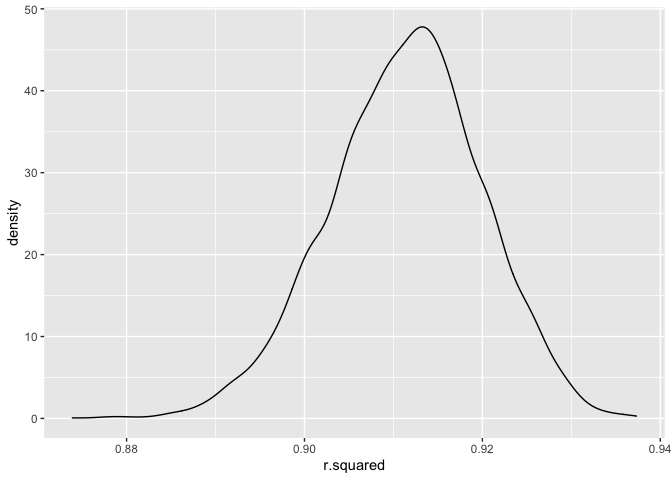
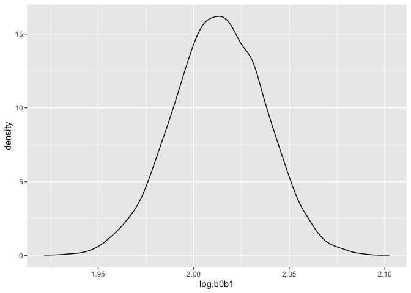

p8105\_hw6\_sz3030
================
Shaocong Zhang
12/4/2021

# Problem 1

``` r
library(tidyverse)
```

    ## ── Attaching packages ─────────────────────────────────────── tidyverse 1.3.1 ──

    ## ✓ ggplot2 3.3.5     ✓ purrr   0.3.4
    ## ✓ tibble  3.1.4     ✓ dplyr   1.0.7
    ## ✓ tidyr   1.1.3     ✓ stringr 1.4.0
    ## ✓ readr   2.0.1     ✓ forcats 0.5.1

    ## ── Conflicts ────────────────────────────────────────── tidyverse_conflicts() ──
    ## x dplyr::filter() masks stats::filter()
    ## x dplyr::lag()    masks stats::lag()

``` r
library(modelr)
library(leaps)
library(mgcv)
```

    ## Loading required package: nlme

    ## 
    ## Attaching package: 'nlme'

    ## The following object is masked from 'package:dplyr':
    ## 
    ##     collapse

    ## This is mgcv 1.8-36. For overview type 'help("mgcv-package")'.

### Load the dataset

``` r
birthweight = read_csv("./data/birthweight.csv")
```

    ## Rows: 4342 Columns: 20

    ## ── Column specification ────────────────────────────────────────────────────────
    ## Delimiter: ","
    ## dbl (20): babysex, bhead, blength, bwt, delwt, fincome, frace, gaweeks, malf...

    ## 
    ## ℹ Use `spec()` to retrieve the full column specification for this data.
    ## ℹ Specify the column types or set `show_col_types = FALSE` to quiet this message.

### Clean the data

``` r
birthweight = 
  birthweight %>% 
  janitor::clean_names() %>%
  mutate(
    babysex = as.factor(babysex),
    babysex = fct_recode(babysex, "male" = "1", 
                         "female" = "2"),
    frace = as.factor(frace),
    frace = fct_recode(frace, "white" = "1", 
                       "black" = "2", 
                       "asian" = "3", 
                       "puerto rican" = "4", 
                       "other" = "8", 
                       "unknown" = "9"),
    malform = as.factor(malform),
    malform = fct_recode(malform, "absent" = "0", 
                         "present" = "1"),
    mrace = as.factor(mrace),
    mrace = fct_recode(mrace, "white" = "1", 
                       "black" = "2", 
                       "asian" = "3", 
                       "puerto rican" = "4"))
```

    ## Warning: Unknown levels in `f`: 9

### Check for missing data

``` r
sum(is.na(birthweight))
```

    ## [1] 0

There is 0 NA value in the dataset.

### model selection

``` r
full.mod = lm(bwt  ~., data = birthweight)

step(full.mod, direction = 'backward', trace = FALSE)
```

    ## 
    ## Call:
    ## lm(formula = bwt ~ babysex + bhead + blength + delwt + fincome + 
    ##     gaweeks + mheight + mrace + parity + ppwt + smoken, data = birthweight)
    ## 
    ## Coefficients:
    ##       (Intercept)      babysexfemale              bhead            blength  
    ##         -6098.822             28.558            130.777             74.947  
    ##             delwt            fincome            gaweeks            mheight  
    ##             4.107              0.318             11.592              6.594  
    ##        mraceblack         mraceasian  mracepuerto rican             parity  
    ##          -138.792            -74.887           -100.678             96.305  
    ##              ppwt             smoken  
    ##            -2.676             -4.843

In the model selection process, I use the backward selection method,
which start with the full model and exclude the covariates to decrease
the AIC value.

``` r
# Thus, the final model should be
final.mod = lm(formula = bwt ~ babysex + bhead + blength + delwt + fincome + 
    gaweeks + mheight + mrace + parity + ppwt + smoken, data = birthweight)

birthweight %>%
  add_predictions(final.mod) %>%
  add_residuals(final.mod) %>%
  ggplot(aes(x = pred, y = resid)) + 
  geom_point() + 
  labs(
    title = "Residuals v.s. fitted values",
    x = "Fitted values",
    y = "Residuals"
  )
```

<!-- -->

### Compare the model to two others

``` r
set.seed(1)

cv_df = 
  crossv_mc(birthweight, 100) %>% 
  mutate(
    maineffect_mod = map(train, ~lm(bwt ~ blength + gaweeks, data = .x)),
    final_mod = map(train, ~lm(bwt ~ babysex + bhead + blength + delwt + fincome + gaweeks + 
                         mheight + mrace + parity + ppwt + smoken, data = .x)),
    complex_mod =  map(train, ~lm(bwt ~ bhead * blength * babysex, data = .x))) %>% 
  mutate(
    rmse_maineffect = map2_dbl(maineffect_mod, test, rmse),
    rmse_final = map2_dbl(final_mod, test, rmse),
    rmse_complex = map2_dbl(complex_mod, test, rmse)) 
```

    ## Warning in predict.lm(model, data): prediction from a rank-deficient fit may be
    ## misleading

``` r
cv_df %>% 
  select(starts_with("rmse")) %>% 
  pivot_longer(
    everything(),
    names_to = "model", 
    values_to = "rmse",
    names_prefix = "rmse_") %>% 
  mutate(model = fct_inorder(model)) %>% 
  ggplot(aes(x = model, y = rmse)) + geom_violin()
```

<!-- -->

It is obvious that the final model, which was selected after the
backward selection, performs best among all the three model. The
maineffect model, which only contains length at birth and gestational
age as predictors, performs worst due to its highest RMSE. The complex
model, which contains head circumference, length, sex, and all
interactions, performs good. However, due to its complexity in model
computing and interpretation, I would not try to use it. The “final
model” would be the best choice.

# Problem 2

### Download the data

``` r
weather_df = 
  rnoaa::meteo_pull_monitors(
    c("USW00094728"),
    var = c("PRCP", "TMIN", "TMAX"), 
    date_min = "2017-01-01",
    date_max = "2017-12-31") %>%
  mutate(
    name = recode(id, USW00094728 = "CentralPark_NY"),
    tmin = tmin / 10,
    tmax = tmax / 10) %>%
  select(name, id, everything())
```

    ## Registered S3 method overwritten by 'hoardr':
    ##   method           from
    ##   print.cache_info httr

    ## using cached file: ~/Library/Caches/R/noaa_ghcnd/USW00094728.dly

    ## date created (size, mb): 2021-10-17 21:45:35 (7.605)

    ## file min/max dates: 1869-01-01 / 2021-10-31

``` r
set.seed(1)

# Plot r square hat
r.sq.hat = 
  weather_df %>% 
  bootstrap(n = 5000) %>% 
  mutate(
    models = map(strap, ~lm(tmax ~ tmin, data = .x) ),
    results = map(models, broom::glance)) %>% 
  select(-strap, -models) %>% 
  unnest(results)

r.sq.hat %>% 
  ggplot(aes(x = r.squared)) + geom_density()
```

<!-- -->

The distribution of the *r̂*<sup>2</sup> is close to the normal
distribution with slight left skewness. The mean value of the
*r̂*<sup>2</sup>’s distribution is at around 0.914. In order to construct
the 95% confidence interval for *r̂*<sup>2</sup>, we could find the 2.5%
and 97.5% quantiles of the bootstrap estimates.

``` r
# Construct 95% confidence interval for r square hat
r.sq.hat %>% 
  summarize(
    ci_lower = quantile(r.squared, 0.025),
    ci_upper = quantile(r.squared, 0.975)
  )
```

    ## # A tibble: 1 × 2
    ##   ci_lower ci_upper
    ##      <dbl>    <dbl>
    ## 1    0.894    0.927

Thus, the 95% confidence interval for *r̂*<sup>2</sup> is (0.8936684,
0.927106).

``` r
# Plot log(beta_0 hat * beta_1 hat)
set.seed(1)

beta.hat = 
  weather_df %>% 
  bootstrap(n = 5000) %>% 
  mutate(
    models = map(strap, ~lm(tmax ~ tmin, data = .x) ),
    results = map(models, broom::tidy)) %>% 
  select(-strap, -models) %>% 
  unnest(results) %>% 
  select(id = `.id`, term, estimate) %>% 
  pivot_wider(
    names_from = term, 
    values_from = estimate) %>% 
  rename(beta0 = '(Intercept)', beta1 = "tmin") %>% 
  mutate(log.b0b1 = log(beta0*beta1))

beta.hat %>% 
  ggplot(aes(x = log.b0b1)) + geom_density()
```

<!-- -->

The distribution of the $log(\\hat{\\beta\_0}\*\\hat{\\beta\_1})$ is
close to the normal distribution with slight left skewness. The mean
value of the $log(\\hat{\\beta\_0}\*\\hat{\\beta\_1})$’s distribution is
at around 2.0125. In order to construct the 95% confidence interval for
$log(\\hat{\\beta\_0}\*\\hat{\\beta\_1})$, we could find the 2.5% and
97.5% quantiles of the bootstrap estimates.

``` r
# Construct 95% confidence interval for log(beta_0 hat * beta_1 hat)
beta.hat %>% 
  summarize(
    ci_lower = quantile(log.b0b1, 0.025),
    ci_upper = quantile(log.b0b1, 0.975)
  )
```

    ## # A tibble: 1 × 2
    ##   ci_lower ci_upper
    ##      <dbl>    <dbl>
    ## 1     1.96     2.06

Thus, the 95% confidence interval for
$log(\\hat{\\beta\_0}\*\\hat{\\beta\_1})$ is (1.964949, 2.058887).
